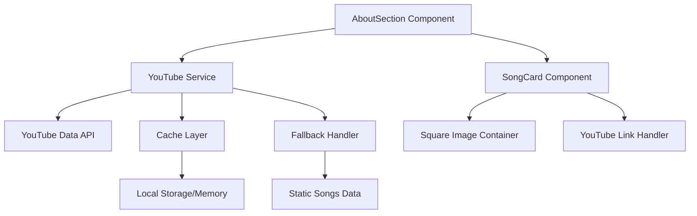

# Design Document

## Overview

This design transforms the existing song recommendation system from static data to dynamic YouTube playlist integration while redesigning the visual presentation to use square (1:1 aspect ratio) cards. The solution maintains backward compatibility by implementing a fallback mechanism to the existing static song data.

The architecture follows a service-oriented approach with clear separation between data fetching, caching, and presentation layers. The design prioritizes performance through caching strategies and graceful error handling.

## Architecture

### High-Level Architecture



### Data Flow

1. **Initialization**: AboutSection component requests song data from YouTube service
2. **API Call**: YouTube service checks cache, then calls YouTube Data API if needed
3. **Data Processing**: Raw YouTube data is transformed into Song interface format
4. **Fallback**: If API fails, system falls back to existing static song data
5. **Rendering**: Processed data is passed to SongCard components with square styling
6. **User Interaction**: Clicking cards navigates to YouTube videos instead of Spotify

## Components and Interfaces

### New Components

#### YouTubeService
```typescript
class YouTubeService {
  private apiKey: string;
  private cache: Map<string, CachedPlaylistData>;
  
  async getPlaylistSongs(playlistId: string): Promise<Song[]>
  private async fetchFromAPI(playlistId: string): Promise<YouTubePlaylistResponse>
  private transformToSongs(apiResponse: YouTubePlaylistResponse): Song[]
  private getCachedData(playlistId: string): Song[] | null
  private setCachedData(playlistId: string, data: Song[]): void
}
```

#### YouTubeConfig
```typescript
interface YouTubeConfig {
  apiKey: string;
  playlistId: string;
  cacheTimeout: number; // in milliseconds
  maxRetries: number;
}
```

### Modified Components

#### SongCard Component
- **Current**: Rectangular cards with hover effects
- **Updated**: Square (1:1) aspect ratio with maintained hover effects
- **Image Handling**: Object-fit cover with proper cropping for square format
- **Link Behavior**: YouTube links instead of Spotify (with fallback)

#### Song Interface Extension
```typescript
interface Song {
  title: string;
  artist: string;
  image: StaticImageData | string;
  link: string;
  youtubeId?: string; // New optional field
  thumbnailUrl?: string; // New optional field for YouTube thumbnails
  source: 'static' | 'youtube'; // New field to track data source
}
```

### New Interfaces

#### YouTube API Response Types
```typescript
interface YouTubePlaylistResponse {
  items: YouTubePlaylistItem[];
  nextPageToken?: string;
}

interface YouTubePlaylistItem {
  snippet: {
    title: string;
    channelTitle: string;
    thumbnails: {
      maxres?: { url: string };
      high?: { url: string };
      medium?: { url: string };
      default: { url: string };
    };
    resourceId: {
      videoId: string;
    };
  };
}

interface CachedPlaylistData {
  songs: Song[];
  timestamp: number;
  playlistId: string;
}
```

## Data Models

### Configuration Model
```typescript
const youtubeConfig: YouTubeConfig = {
  apiKey: process.env.YOUTUBE_API_KEY!,
  playlistId: process.env.YOUTUBE_PLAYLIST_ID || 'default-playlist-id',
  cacheTimeout: 1000 * 60 * 60, // 1 hour
  maxRetries: 3
};
```

### Cache Model
- **Storage**: Browser localStorage for persistence across sessions
- **Structure**: Key-value pairs with playlist ID as key
- **Expiration**: Timestamp-based expiration (1 hour default)
- **Fallback**: Memory cache as secondary option

### Song Data Transformation
```typescript
// YouTube API data → Song interface
const transformYouTubeToSong = (item: YouTubePlaylistItem): Song => ({
  title: extractSongTitle(item.snippet.title),
  artist: extractArtistName(item.snippet.title, item.snippet.channelTitle),
  image: getBestThumbnail(item.snippet.thumbnails),
  link: `https://www.youtube.com/watch?v=${item.snippet.resourceId.videoId}`,
  youtubeId: item.snippet.resourceId.videoId,
  thumbnailUrl: getBestThumbnail(item.snippet.thumbnails),
  source: 'youtube'
});
```

## Error Handling

### API Error Scenarios
1. **Network Failures**: Retry mechanism with exponential backoff
2. **Rate Limiting**: Respect API quotas and implement proper delays
3. **Invalid Playlist**: Fallback to static data with user notification
4. **Missing API Key**: Development warning and fallback to static data

### Fallback Strategy
```typescript
const getSongs = async (): Promise<Song[]> => {
  try {
    const youtubeSongs = await youtubeService.getPlaylistSongs(playlistId);
    return youtubeSongs.length > 0 ? youtubeSongs : staticSongs;
  } catch (error) {
    console.warn('YouTube API failed, using static songs:', error);
    return staticSongs;
  }
};
```

### Image Loading Errors
- **Primary**: YouTube thumbnail URLs
- **Fallback**: Static placeholder image
- **Loading States**: Skeleton loaders during fetch

## Testing Strategy

### Unit Tests
- **YouTubeService**: API calls, data transformation, caching logic
- **SongCard**: Square aspect ratio rendering, link behavior
- **Error Handling**: Fallback mechanisms, retry logic

### Integration Tests
- **API Integration**: Real YouTube API calls with test playlist
- **Cache Behavior**: Cache hit/miss scenarios, expiration
- **Component Integration**: AboutSection with YouTube service

### Visual Regression Tests
- **Square Cards**: Aspect ratio consistency across breakpoints
- **Image Fitting**: Proper cropping and scaling in square containers
- **Hover Effects**: Maintained animations and transitions

### Performance Tests
- **API Response Time**: Measure YouTube API call duration
- **Cache Effectiveness**: Hit rate and performance improvement
- **Image Loading**: Thumbnail load times and optimization

## Implementation Considerations

### Security
- **API Key Protection**: Environment variables only, never in client code
- **CORS Handling**: Proper YouTube API CORS configuration
- **Rate Limiting**: Respect YouTube API quotas and implement client-side limiting

### Performance Optimizations
- **Image Optimization**: Next.js Image component with proper sizing
- **Lazy Loading**: Load thumbnails as cards come into viewport
- **Caching Strategy**: Multi-layer caching (memory + localStorage)
- **API Batching**: Fetch multiple playlist items in single request

### Responsive Design
- **Square Aspect Ratio**: Maintained across all breakpoints
- **Card Sizing**: Responsive dimensions while preserving 1:1 ratio
- **Grid Layout**: Proper spacing and alignment in horizontal scroll

### Accessibility
- **Screen Readers**: Proper aria-labels for YouTube content
- **Keyboard Navigation**: Maintained focus management
- **Alt Text**: Descriptive alt text for song thumbnails
- **Color Contrast**: Ensure overlay text meets WCAG standards